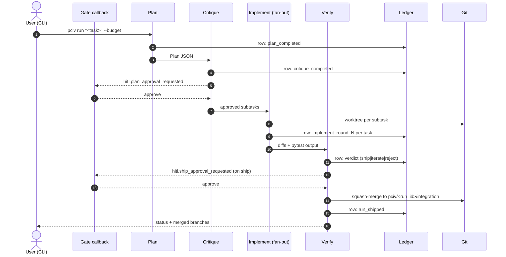

# pciv

Plan → Critique → Implement → Verify orchestration CLI for complex coding
tasks, backed by Azure OpenAI and per-subtask git worktrees.

## Badges

[](https://github.com/patschmitt91/PCIV/actions/workflows/ci.yml)
[](https://github.com/patschmitt91/PCIV/actions/workflows/codeql.yml)


## Status

Alpha / research prototype, v0.1.0. Four phases are wired and tested with
mocked Azure clients (28 tests). No live-provider results yet. The
orchestration spine is a plain async `Pipeline`; a port to
[microsoft/agent-framework][af] graph primitives is specified in
[ADR-0001](docs/decisions/0001-agent-framework-port.md) and tracked as v0.2.

## What it does

`pciv run "<task>"` runs four phases against Azure OpenAI: a reasoning
deployment writes a structured plan, the same deployment critiques it, a
codegen deployment implements each subtask in its own git worktree (with a
tool loop over `read_file`, `write_file`, `list_dir`, `run_pytest`), and the
reasoning deployment verifies the diffs and pytest output with a verdict in
`{ship, iterate, reject}`. Every transition is logged to a SQLite ledger;
two HITL gates (plan approval, ship approval) are mediated by a callback.

## Why it might matter

Single-agent coding runs collapse planning, implementation, and
verification into one prompt, which makes budget enforcement and failure
attribution hard. Splitting them into addressable phases with a ledger lets
a reviewer inspect exactly which subtask failed, why, and at what cost.
[microsoft/agent-framework][af] is a declared dependency; ADR-0001 tracks
replacing the async spine with the framework's graph primitives.

## Install

```
uv sync --extra dev
```

Requires Python 3.11+ and `uv`. Set the Azure OpenAI environment variables
listed under [Azure OpenAI setup](#azure-openai-setup) before `pciv run`.

## Quickstart

Install dependencies, confirm the version, run the environment check, see
what a run would look like, then build and run the container.

```
$ uv sync
$ uv run pciv --version
$ uv run pciv doctor
$ uv run pciv run --help
$ docker build -t pciv:0.2.0 .
$ docker run --rm pciv:0.2.0 doctor
```

Expected output shape:

```
run_id=<uuid> projected_usd=0.3412 ceiling_usd=2.0000
=== HITL gate: plan_approval ===
{ "subtasks": [...] }
plan_approval gate decision [approve]: approve
...
status=merged verdict=ship spent_usd=0.4217
integration_branch=pciv/<run_id>/integration
merged_tasks=['task_01', 'task_02']
```

## Architecture



See [docs/agent-framework-composition.md](docs/agent-framework-composition.md)
for the before/after view relative to the ADR-0001 port.

## Phases

| # | Phase     | Deployment role | Artifact                           |
|---|-----------|-----------------|------------------------------------|
| 1 | Plan      | reasoning       | `Plan` JSON (subtasks, deps)       |
| 2 | Critique  | reasoning       | `Critique` verdict (must pass)     |
| 3 | Implement | codegen         | per-subtask diff + pytest output   |
| 4 | Verify    | reasoning       | `VerdictReport` in {ship, iterate, reject} |

`iterate` re-queues only the subtasks marked `iterate`, with the verifier's
per-subtask feedback, up to `--max-iter` rounds (default 2).

## Configuration

All model deployments, timeouts, retries, projection coefficients, iteration
caps, gate defaults, and telemetry env-var names live in
[plan.yaml](plan.yaml). Every key is documented in
[docs/configuration.md](docs/configuration.md).

## Artifacts and inspection

On every run, pciv writes:

- `.pciv/ledger.db` — SQLite ledger (schema in `src/pciv/state/schema.sql`).
- `.pciv/worktrees/<run_id>/<task_id>/` — per-subtask git worktrees.
- `pciv/<run_id>/<task_id>` — per-subtask git branches.
- `pciv/<run_id>/integration` — squash-merge target on a successful run.

Five useful queries against the ledger (`sqlite3 .pciv/ledger.db`):

**1. Last 10 runs with status and spend.**

```sql
SELECT r.run_id, r.status, r.started_at, r.ended_at,
       ROUND(COALESCE(SUM(ce.cost_usd), 0), 4) AS spent_usd
FROM runs r
LEFT JOIN cost_events ce ON ce.run_id = r.run_id
GROUP BY r.run_id
ORDER BY r.started_at DESC
LIMIT 10;
-- run_id | status  | started_at           | ended_at             | spent_usd
-- abcd…  | merged  | 2026-04-24T19:02:11Z | 2026-04-24T19:07:44Z | 0.4217
```

**2. Cost by phase for a run.**

```sql
SELECT phase, COUNT(*) AS invocations,
       ROUND(SUM(cost_usd), 4) AS cost_usd
FROM agent_invocations
WHERE run_id = :run_id
GROUP BY phase
ORDER BY cost_usd DESC;
-- phase      | invocations | cost_usd
-- implement  | 6           | 0.2841
-- verify     | 1           | 0.0712
-- plan       | 1           | 0.0412
-- critique   | 1           | 0.0252
```

**3. Verdict history of a run (iterate → ship).**

```sql
SELECT iteration, verdict, per_subtask
FROM verdicts
WHERE run_id = :run_id
ORDER BY iteration;
-- iteration | verdict | per_subtask
-- 1         | iterate | {"task_01":"ship","task_02":"iterate"}
-- 2         | ship    | {"task_01":"ship","task_02":"ship"}
```

**4. Failed agent invocations (non-ship terminal status).**

```sql
SELECT iteration, phase, agent_id, task_id, status, error
FROM agent_invocations
WHERE run_id = :run_id AND status != 'succeeded'
ORDER BY iteration, phase;
```

**5. Top-cost runs in the last 7 days.**

```sql
SELECT r.run_id, r.task, ROUND(SUM(ce.cost_usd), 4) AS spent_usd
FROM runs r JOIN cost_events ce ON ce.run_id = r.run_id
WHERE r.started_at >= date('now', '-7 days')
GROUP BY r.run_id
ORDER BY spent_usd DESC
LIMIT 5;
```

## Running non-interactively

`pciv run` can be driven from CI or a daemon as long as the HITL gates are
handled. Three modes:

- **`--yes`** auto-approves both gates (`plan_approval`, `ship_approval`)
  with a stdout notice. Suitable for CI runs on trusted tasks.
- **Webhook approver (v0.2).** A pluggable approver that POSTs the gate
  payload to a configured URL and awaits a signed response. Specified in
  [ADR-0001](docs/decisions/0001-agent-framework-port.md) and tracked in
  [docs/roadmap.md](docs/roadmap.md).
- **Default (interactive).** `typer.prompt` reads a decision in
  `{approve, revise, reject, abort}` from stdin.

### Exit codes

| Code | Meaning                                                    |
|------|------------------------------------------------------------|
| 0    | Run reached a success status (`merged` or `ship`).         |
| 1    | Run reached a non-success terminal status (rejected, etc). |
| 2    | Preflight budget exceeded (`BudgetExceededError`). Includes both per-run cap breaches and cross-run rolling-window cap breaches. |
| 3    | Config file not found (`FileNotFoundError`).               |

### Cross-run budget enforcement

Per-run `--budget` is a single-process cap. To bound spend across many
sequential `pciv run` invocations, set `[budget].monthly_cap_usd` (and
optionally `[budget].window`, `monthly` or `daily`) in `plan.yaml`.
PCIV mounts a SQLite-backed `agentcore.budget.PersistentBudgetLedger`
on `runtime.sqlite_path` and refuses to start a run whose projected
cost wouldn't fit in the rolling window's remaining allowance. See
[ADR-0007](docs/decisions/0007-cross-run-budget-ledger.md) and
[tests/test_cross_run_budget.py](tests/test_cross_run_budget.py) for
the integration test that exercises two sequential CLI invocations
sharing the cap.

For documented emergencies, `pciv run --ignore-cross-run-cap` skips
the cross-run check (the per-run `--budget` still applies), logs a
WARNING with the exhausted-cap message, and records the spend with
`forced=1` in the `budget_window` audit table.

## Azure OpenAI setup

Four logical deployments; today three can point at the same underlying
model, but keeping them as separate deployments lets you rate-limit or
upgrade them independently.

| Env variable                           | Role        | Placeholder       | Suggested model |
|----------------------------------------|-------------|-------------------|-----------------|
| `AZURE_OPENAI_PLAN_DEPLOYMENT`         | Plan        | `azure-reasoning` | a reasoning-class chat model |
| `AZURE_OPENAI_CRITIC_DEPLOYMENT`       | Critique    | `azure-reasoning` | same as plan                |
| `AZURE_OPENAI_IMPLEMENT_DEPLOYMENT`    | Implement   | `azure-codegen`   | a fast codegen chat model   |
| `AZURE_OPENAI_VERIFY_DEPLOYMENT`       | Verify      | `azure-reasoning` | same as plan                |

Also required:

- `AZURE_OPENAI_ENDPOINT` — resource endpoint (ends in
  `.openai.azure.com`).
- `AZURE_OPENAI_API_KEY` — API key for that resource.
- `AZURE_OPENAI_API_VERSION` — defaults to `2024-10-21`. See the
  [API versions reference][apiver].

Create each deployment with the
[Azure CLI][azcli] (pick your own model, sku, and capacity):

```
az cognitiveservices account deployment create \
  --name <resource-name> --resource-group <rg> \
  --deployment-name <env-var-value> \
  --model-name <model-name> --model-version <version> \
  --model-format OpenAI \
  --sku-capacity 30 --sku-name Standard
```

## Benchmarks

No live-provider bench results for v0.1. The test suite exercises the
pipeline end-to-end with mocked Azure clients. See
[docs/roadmap.md](docs/roadmap.md) for the v0.2 bench harness plan.

## Roadmap

Dated milestones live in [docs/roadmap.md](docs/roadmap.md). The next
milestone (v0.2) is the ADR-0001 port of the orchestration spine to
agent-framework graph primitives, plus the webhook `Approver`
implementation for non-interactive HITL.

## Development

Common tasks are wired through a top-level [`justfile`](justfile). Install
[`just`](https://github.com/casey/just), then:

```
just install     # uv sync --extra dev
just lint        # ruff check
just fmt         # ruff format
just typecheck   # mypy --strict src/pciv
just test        # pytest with coverage gate
just cov         # pytest + coverage XML
just build       # uv build (sdist + wheel into dist/)
just clean       # remove dist/, caches, .coverage
```

`just` is not required — each recipe is a one-liner that shells out to
`uv`, so the underlying commands can be run directly.

## Security

See [SECURITY.md](SECURITY.md) for supported versions and how to report
a vulnerability privately.

## License and citation

MIT — see [LICENSE](LICENSE). If you cite this project in academic work:

```
@software{pciv_2026,
  title  = {pciv: Plan-Critique-Implement-Verify orchestration CLI},
  author = {pciv contributors},
  year   = {2026},
  url    = {https://github.com/patschmitt91/PCIV}
}
```

[af]: https://github.com/microsoft/agent-framework
[apiver]: https://learn.microsoft.com/azure/ai-services/openai/reference
[azcli]: https://learn.microsoft.com/cli/azure/cognitiveservices/account/deployment
