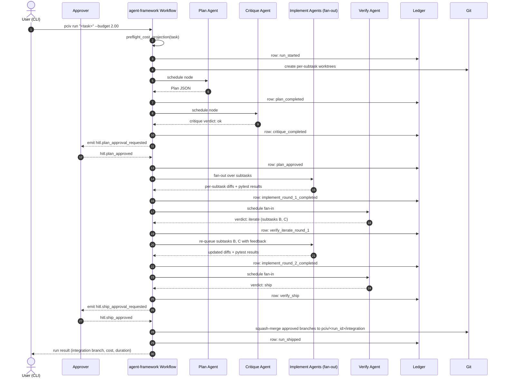

# PCIV composition with microsoft/agent-framework

PCIV's v0.0 orchestration spine was a plain `async Pipeline` class
that called the four agents directly. v0.1 ports the spine to
agent-framework's graph workflow primitives. This document shows
the two shapes side by side and maps every element of the old spine
to its agent-framework equivalent.

The port is motivated and specified in
[ADR-0001](decisions/0001-agent-framework-port.md).

## Before — v0.0 `async Pipeline`

```mermaid
flowchart TD
    Start([pciv run task]) --> Preflight{preflight<br/>projected cost<br/>&le; budget?}
    Preflight -- no --> Abort([PreflightBudgetExceeded])
    Preflight -- yes --> Plan[Plan agent<br/>azure-reasoning]
    Plan --> Critique[Critique agent<br/>azure-reasoning]
    Critique -- reject --> Fail([run rejected])
    Critique -- ok --> HITL1{{input&#40;&#41;<br/>plan approval}}
    HITL1 -- no --> Fail
    HITL1 -- yes --> Sem[asyncio.Semaphore&#40;N&#41;<br/>caps implementer concurrency]
    Sem --> Imp1[Implement #1<br/>worktree 1]
    Sem --> Imp2[Implement #2<br/>worktree 2]
    Sem --> ImpN[Implement #N<br/>worktree N]
    Imp1 --> Verify[Verify agent<br/>azure-reasoning]
    Imp2 --> Verify
    ImpN --> Verify
    Verify -- iterate --> Sem
    Verify -- reject --> Fail
    Verify -- ship --> HITL2{{input&#40;&#41;<br/>ship approval}}
    HITL2 -- no --> Leave([leave branches;<br/>no integration merge])
    HITL2 -- yes --> Merge[squash-merge each<br/>approved subtask onto<br/>pciv/&lt;run_id&gt;/integration]
    Merge --> Done([run shipped])

    Ledger[(.pciv/ledger.db)]
    Plan -.write.-> Ledger
    Critique -.write.-> Ledger
    Imp1 -.write.-> Ledger
    Imp2 -.write.-> Ledger
    ImpN -.write.-> Ledger
    Verify -.write.-> Ledger
    Merge -.write.-> Ledger

    classDef problem fill:#fde7e9,stroke:#c4314b,color:#1a1a1a;
    class Sem,HITL1,HITL2 problem;
```

**Problems visible in the diagram.** The three red nodes are the
structural issues called out in ADR-0001:

- The semaphore is application-level scheduling logic that duplicates
  what the framework's scheduler already does.
- Both HITL gates are inline `input()` calls, unreachable from any
  non-interactive runner.
- Ledger writes are scattered across the agents, each of which has
  to remember to write. Miss one, and the ledger drifts from the
  real run state.

## After — v0.1 agent-framework graph workflow

```mermaid
flowchart TD
    Start([pciv run task]) --> PreflightHook[/workflow preflight hook<br/>aborts before first dispatch/]
    PreflightHook -- over budget --> Abort([PreflightBudgetExceeded])
    PreflightHook -- ok --> Setup[/workflow setup<br/>create worktrees/]
    Setup --> PlanNode[Plan<br/>agent_framework.Agent<br/>node]
    PlanNode --> CritiqueNode[Critique<br/>agent_framework.Agent<br/>node]
    CritiqueNode -- reject edge --> Fail([run rejected])
    CritiqueNode -- ok --> GateEvent1[/workflow event:<br/>hitl.plan_approval_requested/]
    GateEvent1 --> Approver1{Approver<br/>&#40;interactive CLI&#124;<br/>--yes&#124;webhook&#41;}
    Approver1 -- hitl.plan_rejected --> Fail
    Approver1 -- hitl.plan_approved --> FanOut[Workflow fan-out<br/>one agent-framework.Agent<br/>per subtask,<br/>scheduler-managed concurrency]
    FanOut --> ImpA[Implement subtask A<br/>worktree-bound via<br/>agent context]
    FanOut --> ImpB[Implement subtask B<br/>worktree-bound via<br/>agent context]
    FanOut --> ImpC[Implement subtask C<br/>worktree-bound via<br/>agent context]
    ImpA --> VerifyNode[Verify<br/>fan-in node]
    ImpB --> VerifyNode
    ImpC --> VerifyNode
    VerifyNode -- iterate edge<br/>loop cap 2 --> FanOut
    VerifyNode -- reject edge --> Fail
    VerifyNode -- ship edge --> GateEvent2[/workflow event:<br/>hitl.ship_approval_requested/]
    GateEvent2 --> Approver2{Approver}
    Approver2 -- hitl.ship_rejected --> Leave([leave branches;<br/>no integration merge])
    Approver2 -- hitl.ship_approved --> MergeNode[Terminal node:<br/>squash-merge approved<br/>branches onto<br/>pciv/&lt;run_id&gt;/integration]
    MergeNode --> Teardown[/workflow teardown<br/>optional cleanup/]
    Teardown --> Done([run shipped])

    Ledger[(.pciv/ledger.db)]
    Middleware[[Ledger middleware<br/>writes on every<br/>node enter/exit/error<br/>and every event]]
    Middleware -.-> Ledger
    PlanNode -.observed by.-> Middleware
    CritiqueNode -.observed by.-> Middleware
    FanOut -.observed by.-> Middleware
    ImpA -.observed by.-> Middleware
    ImpB -.observed by.-> Middleware
    ImpC -.observed by.-> Middleware
    VerifyNode -.observed by.-> Middleware
    MergeNode -.observed by.-> Middleware
    GateEvent1 -.observed by.-> Middleware
    GateEvent2 -.observed by.-> Middleware

    classDef fw fill:#e7f0fd,stroke:#1f6feb,color:#0a1a2a;
    class PlanNode,CritiqueNode,FanOut,ImpA,ImpB,ImpC,VerifyNode,MergeNode,PreflightHook,Setup,Teardown fw;
    classDef event fill:#fff4d6,stroke:#bf8700,color:#2a1f00;
    class GateEvent1,GateEvent2 event;
    classDef approver fill:#f0e7fd,stroke:#8250df,color:#1a0a2a;
    class Approver1,Approver2 approver;
```

Blue nodes are agent-framework workflow primitives. Yellow nodes are
agent-framework events. Purple nodes are `Approver` implementations
(user code that consumes events and emits responses).

## Sequence view of a single run

Useful for understanding the event flow during a run with one
iterate round.

## What each agent-framework primitive gives us

A paragraph per primitive, so a reader evaluating composition can
see exactly which framework features we depend on.

**Workflow graph.** The four phases + terminal merge are nodes; the
verify-iterate loop is a conditional edge. The graph structure itself
becomes the source of truth for control flow, replacing the
imperative `Pipeline` methods. Benefit: control flow is inspectable
(`pciv policy show --format mermaid` renders it), testable node-by-
node, and modifiable without touching agent code.

**`agent_framework.Agent` instances.** Each of Plan, Critique,
Implement, Verify is an `Agent`. Implement agents are cloned per
subtask with agent context carrying the worktree path, subtask spec,
and (on iterate rounds) the verifier's feedback. Benefit: a uniform
agent interface across phases; tool-use, retries, and streaming are
framework concerns, not PCIV concerns.

**Workflow events for HITL.** The two approval gates are events,
not inline calls. An `Approver` interface consumes the event and
returns an approval/rejection. We ship three implementations:
`CLIApprover` (interactive stdin), `AutoApprover` (backs `--yes`),
and `WebhookApprover` (POSTs to a configured URL and awaits a
signed response). Benefit: PCIV runs unchanged in CI, in an Azure
Function, in a Teams bot — anywhere the `Approver` protocol is
implemented.

**Scheduler-managed concurrency.** Implement fan-out concurrency is
a graph configuration (`implement_concurrency: 4`), not an
application `Semaphore`. Benefit: we get preemption and fair
scheduling for free when the framework adds them; we can change the
cap without touching code.

**Ledger middleware.** A single middleware observes every node
transition and every event, and writes a ledger row. Benefit:
uniform, exhaustive, and correct-by-construction ledger coverage;
no agent has to remember to write; adding a new node or event adds
ledger rows automatically.

**Preflight, setup, teardown hooks.** Budget projection runs as a
preflight hook before the first node is scheduled. Worktree creation
runs in setup; optional cleanup runs in teardown. Benefit: the
"nothing touches the network until we've said we can afford it"
invariant is enforced at the framework level, not by convention.

## What we would like from agent-framework next

These are the upstream asks enumerated in ADR-0001 §"Upstream asks."
Each one would let us delete code we currently maintain:

1. **First-class HITL event types** with a documented `Approver`
   protocol. Today we define our own `hitl.*` event names and our
   own `Approver` interface; if these were framework primitives,
   every agent-framework user would get the same shape.
2. **Budget-aware scheduling.** A hook the scheduler consults before
   dispatching a node, to project incremental cost and abort if the
   cumulative projection exceeds a cap.
3. **Ledger/audit middleware interface.** A documented middleware
   shape for recording transitions to external storage (SQLite,
   Application Insights, OTEL logs, etc.). Today every project
   reinvents this.
4. **Per-node concurrency caps.** We need a cap on the Implement
   node specifically, independent of the workflow's global worker-
   pool size. Today we set the cap at the workflow level, which
   over-constrains the serial phases.

Each of these will be filed as an issue on `microsoft/agent-framework`
once the port lands, linking back to this document.